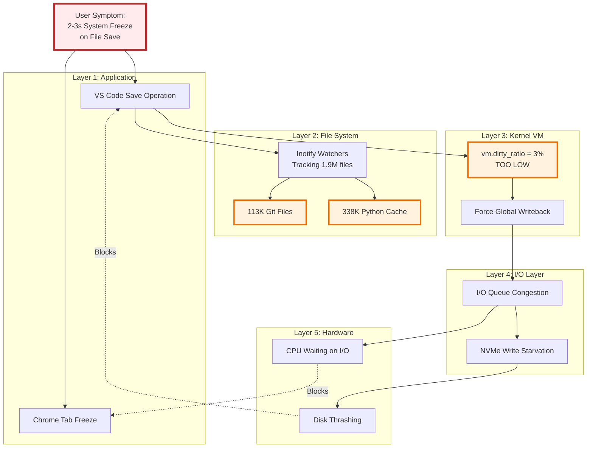
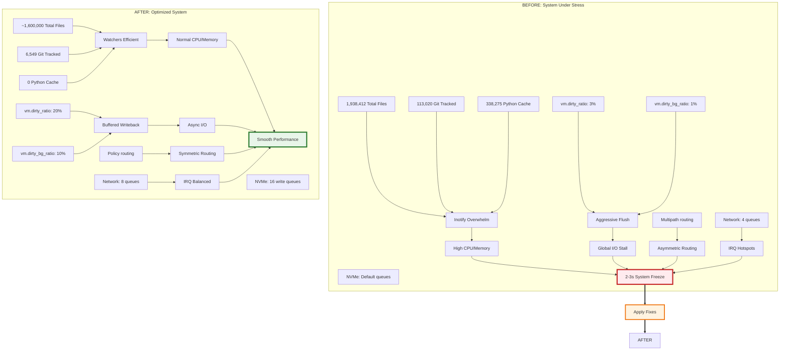
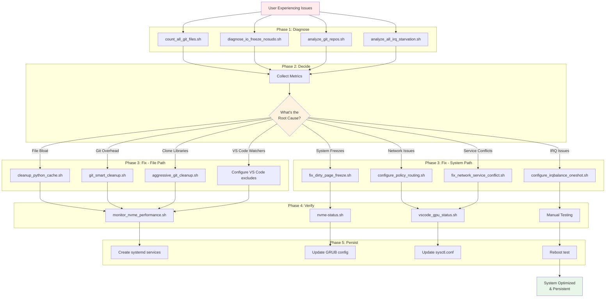
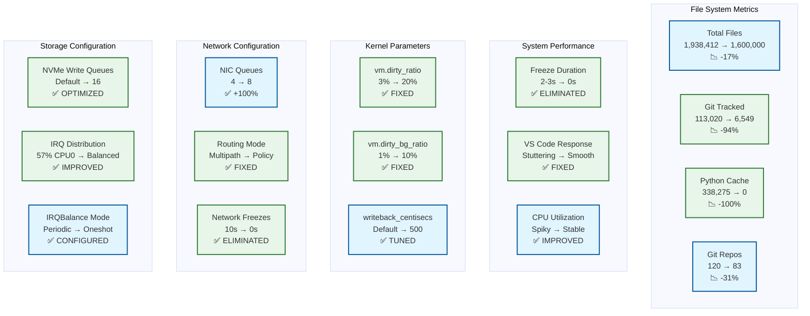
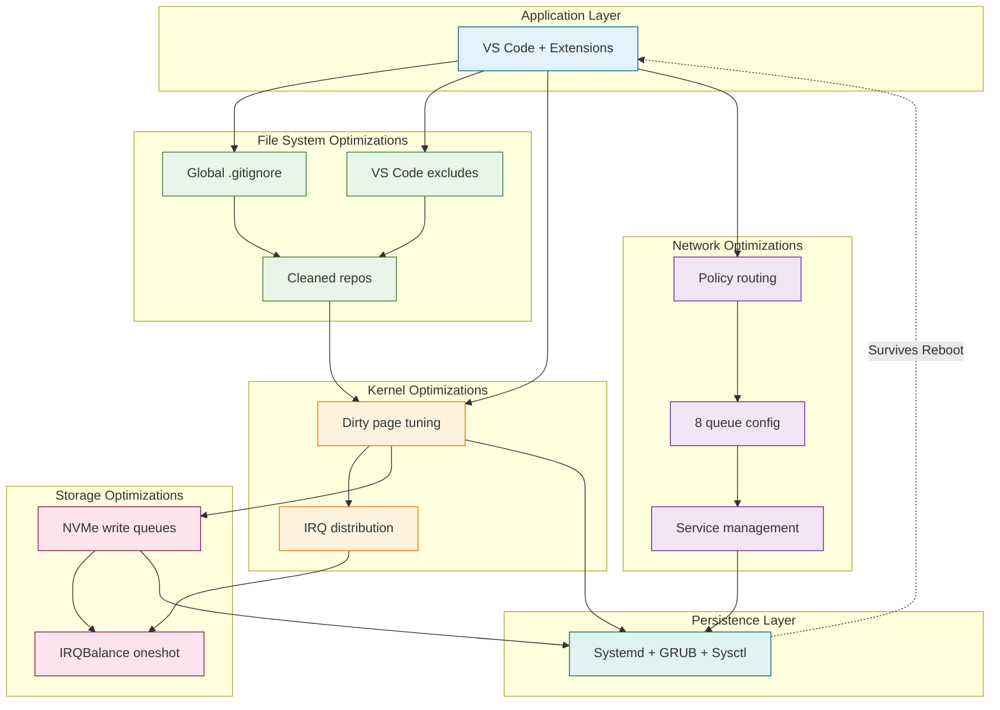

# Comprehensive Solution Map

This document provides a high-level overview of the complete problem-to-solution journey for the VS Code performance fix project.

---

## 1. Complete Problem-Solution Journey


---

## 2. Multi-Layer Problem Analysis



---

## 3. Solution Implementation Timeline

```mermaid
timeline
    title Implementation Phases
    section Phase 1: File System Cleanup
        Oct 17 : Diagnose file bloat
               : Remove 338K Python cache
               : Configure git excludes
               : Result: 94% reduction in tracked files
    section Phase 2: Kernel Tuning
        Oct 18 : Identify dirty page issue
               : Raise vm.dirty_ratio 3%→20%
               : Raise vm.dirty_background_ratio 1%→10%
               : Result: Eliminated system freezes
    section Phase 3: Network Optimization
        Oct 18 : Discover asymmetric routing
               : Implement policy routing
               : Increase queues 4→8
               : Fix service conflicts
               : Result: Smooth network performance
    section Phase 4: Storage Optimization
        Oct 18 : Analyze NVMe IRQ starvation
               : Add write queues to WD SN750
               : Configure IRQBalance oneshot
               : Result: Improved I/O latency
    section Phase 5: Verification & Docs
        Oct 18 : Post-reboot verification
               : Create comprehensive docs
        Nov 14 : Add mermaid diagrams
               : Restructure README
               : Result: Complete, documented solution
```

---

## 4. Before vs After: System State Comparison



---

## 5. Tool Categories and Usage Flow



---

## 6. Documentation Structure

```mermaid
graph LR
    subgraph "Entry Points"
        README[README.md<br/>Main Guide]
        DIAGRAMS[diagrams/<br/>Visual Guides]
    end

    subgraph "Summary Documents"
        COMPLETE[COMPLETE_SOLUTION_SUMMARY.md]
        PERF[PERFORMANCE_FIX_SUCCESS.md]
        SUCCESS[NVME_FIX_SUCCESS.md]
    end

    subgraph "Deep Dive Analysis"
        BACKPRESSURE[backpressure_analysis_report.md]
        NVME[NVME_REAL_ROOT_CAUSE.md]
        NETWORK[NETWORK_MULTIPATH_FREEZE_ANALYSIS.md]
        IRQ[IRQ_STARVATION_SUMMARY.md]
        POLICY[POLICY_ROUTING_EXPLAINED.md]
    end

    subgraph "Configuration Guides"
        IRQBALANCE[IRQBALANCE_CONFIGURATION.md]
        MULTIPATH[MULTIPATH_FIX_APPLIED.md]
        DUAL_BOOT[DUAL_UBUNTU_BOOT_GUIDE.md]
        GPU[GPU_CONFIGURATION.md]
    end

    subgraph "Post-Implementation"
        VERIFY[POST_REBOOT_VERIFICATION.md]
        REBOOT[REBOOT_TEST_RESULTS.md]
        CHECKLIST[PRE_REBOOT_CHECKLIST.md]
    end

    README --> DIAGRAMS
    README --> COMPLETE
    README --> PERF

    COMPLETE --> Deep Dive Analysis
    PERF --> Deep Dive Analysis

    Deep Dive Analysis --> Configuration Guides
    Configuration Guides --> Post-Implementation

    DIAGRAMS -.Visualizes.-> Deep Dive Analysis
    DIAGRAMS -.Visualizes.-> Configuration Guides

    classDef entry fill:#e3f2fd,stroke:#01579b,stroke-width:3px
    classDef summary fill:#f3e5f5,stroke:#4a148c,stroke-width:2px
    classDef analysis fill:#fff3e0,stroke:#e65100,stroke-width:2px
    classDef config fill:#e8f5e9,stroke:#1b5e20,stroke-width:2px
    classDef verify fill:#fce4ec,stroke:#880e4f,stroke-width:2px

    class README,DIAGRAMS entry
    class COMPLETE,PERF,SUCCESS summary
    class BACKPRESSURE,NVME,NETWORK,IRQ,POLICY analysis
    class IRQBALANCE,MULTIPATH,DUAL_BOOT,GPU config
    class VERIFY,REBOOT,CHECKLIST verify
```

---

## 7. Key Metrics Dashboard



---

## 8. Integration Points

Shows how different components of the solution work together:



---

## Usage

These comprehensive diagrams provide:
1. **Journey map** - Emotional/progress flow through the fix process
2. **Problem analysis** - Multi-layer technical breakdown
3. **Timeline** - Chronological implementation phases
4. **Before/After** - State comparison with metrics
5. **Tool flow** - How to use the repository's tools
6. **Documentation** - How docs relate to each other
7. **Metrics** - Key performance indicators
8. **Integration** - How solutions work together

Render these in:
- GitHub (native mermaid support)
- VS Code with Mermaid Preview
- Mermaid Live Editor (https://mermaid.live/)
