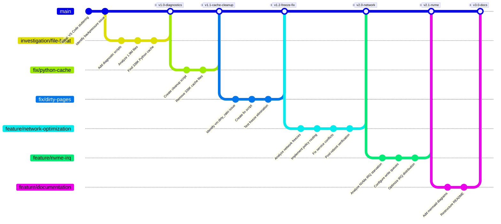
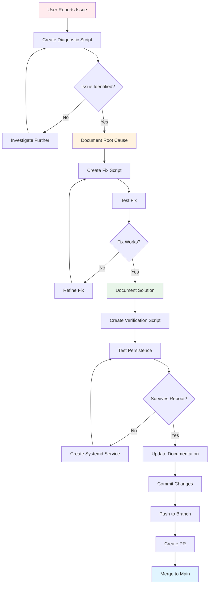
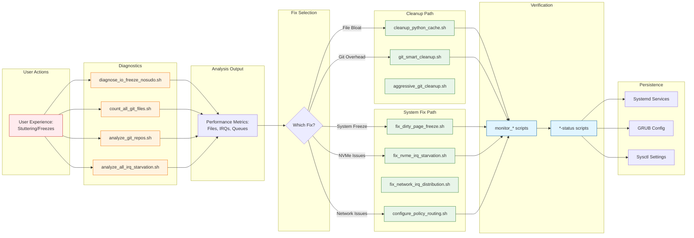
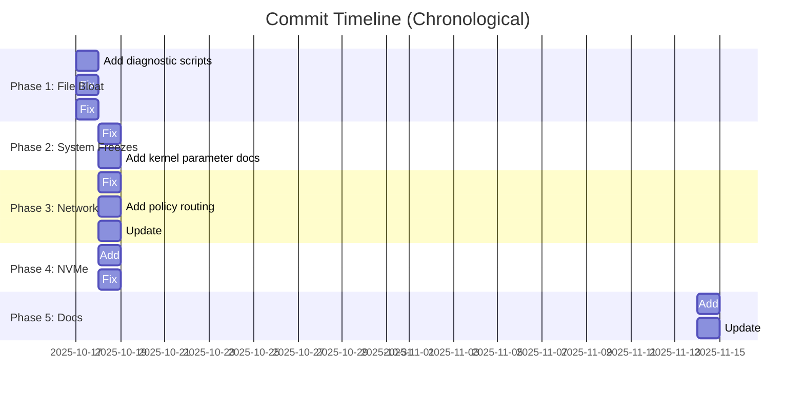
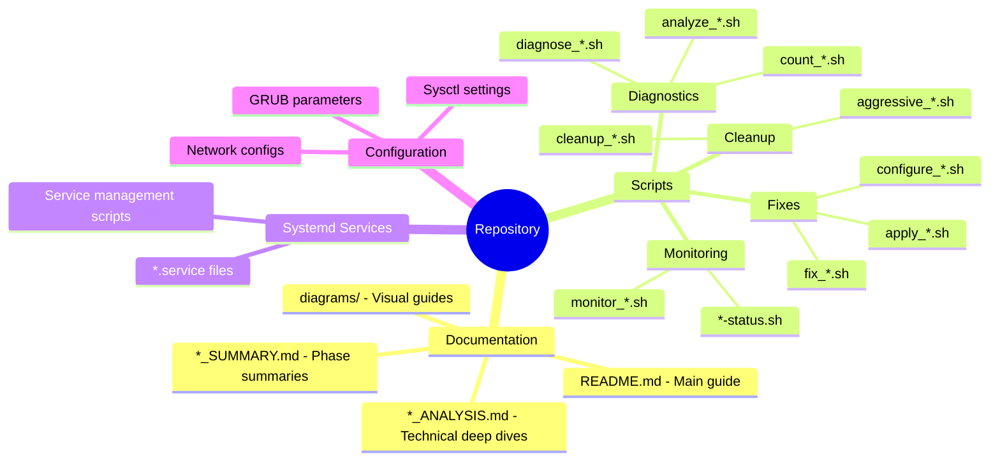
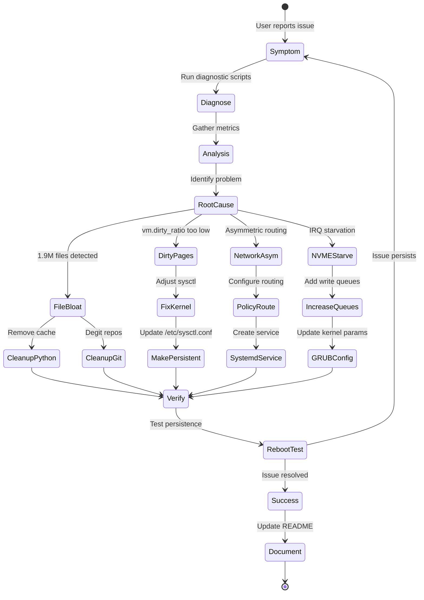

# Git and Repository Workflow Diagrams

This file contains mermaid diagrams explaining the git workflow and repository structure for the vscode-performance-fix project.

---

## 1. Repository Structure & Organization

```mermaid
graph TB
    subgraph "Documentation"
        README[README.md<br/>Main Entry Point]
        COMPLETE[COMPLETE_SOLUTION_SUMMARY.md<br/>Phase 1 Results]
        PERF[PERFORMANCE_FIX_SUCCESS.md<br/>Success Metrics]
        DIAGRAMS[diagrams/<br/>Mermaid Visualizations]
    end

    subgraph "Problem Analysis Docs"
        BACKPRESSURE[backpressure_analysis_report.md]
        NVME_ANALYSIS[NVME_* Analysis Docs]
        IRQ_ANALYSIS[IRQ_* Analysis Docs]
        NETWORK_ANALYSIS[NETWORK_* Analysis Docs]
        POLICY[POLICY_ROUTING_EXPLAINED.md]
    end

    subgraph "Diagnostic Tools"
        DIAG_IO[diagnose_io_freeze_nosudo.sh]
        COUNT_GIT[count_all_git_files.sh]
        ANALYZE_GIT[analyze_git_repos.sh]
        ANALYZE_IRQ[analyze_all_irq_starvation.sh]
    end

    subgraph "Cleanup Tools"
        CLEANUP_PY[cleanup_python_cache.sh]
        GIT_SMART[git_smart_cleanup.sh]
        GIT_COMP[git_cleanup_comprehensive.sh]
        AGGRESSIVE[aggressive_git_cleanup.sh]
        DEGIT[aggressive_degit_phase2.sh]
    end

    subgraph "Fix Scripts"
        FIX_DIRTY[fix_dirty_page_freeze.sh]
        FIX_NVME[fix_nvme_irq_starvation*.sh]
        FIX_NET[fix_network_*.sh]
        CONFIG_POLICY[configure_policy_routing.sh]
        CONFIG_IRQ[configure_irqbalance_oneshot.sh]
    end

    subgraph "Monitoring Tools"
        MONITOR_NVME[monitor_nvme_performance.sh]
        NVME_STATUS[nvme-status.sh]
        VSCODE_GPU[vscode_gpu_status.sh]
        SYS_STATUS[system-status-motd.sh]
    end

    README --> DIAGRAMS
    README --> COMPLETE
    README --> PERF

    COMPLETE --> Problem Analysis Docs
    PERF --> Problem Analysis Docs

    README --> Diagnostic Tools
    README --> Cleanup Tools
    README --> Fix Scripts

    classDef docStyle fill:#e1f5ff,stroke:#01579b
    classDef toolStyle fill:#fff3e0,stroke:#e65100
    classDef fixStyle fill:#e8f5e9,stroke:#2e7d32

    class README,COMPLETE,PERF,DIAGRAMS docStyle
    class DIAG_IO,COUNT_GIT,ANALYZE_GIT,ANALYZE_IRQ toolStyle
    class FIX_DIRTY,FIX_NVME,FIX_NET,CONFIG_POLICY fixStyle
```

---

## 2. Git Branch Strategy



---

## 3. Development Workflow



---

## 4. Tool Dependency Graph



---

## 5. System Architecture - Full Stack

```mermaid
graph TB
    subgraph "User Space"
        VSCODE[VS Code<br/>Electron App]
        CHROME[Chrome Browser]
        OTHER[Other Apps]
    end

    subgraph "File System Layer"
        INOTIFY[Inotify<br/>File Watchers]
        GITFS[Git Repositories<br/>113K→6.5K files]
        CACHE[Python Cache<br/>338K→0 files]
    end

    subgraph "Kernel VM Layer"
        DIRTY[Dirty Page Cache<br/>ratio: 3%→20%<br/>bg_ratio: 1%→10%]
        SCHED[CPU Scheduler]
    end

    subgraph "Network Stack"
        POLICY[Policy Routing<br/>3 NICs, 3 IPs]
        QUEUES[Network Queues<br/>4→8 combined]
        IRQ_NET[Network IRQs<br/>Distributed]
    end

    subgraph "Storage Stack"
        NVME0[NVMe0 Intel 660P<br/>9 queues]
        NVME1[NVMe1 WD SN750<br/>49 queues, 16 write]
        IRQ_NVME[NVMe IRQs<br/>Balanced]
    end

    subgraph "Hardware"
        CPU[AMD Threadripper<br/>Multi-core]
        NIC[Intel X540-T2<br/>Dual 10G]
        STORAGE[Dual NVMe SSDs]
    end

    VSCODE --> INOTIFY
    CHROME --> Kernel VM Layer
    OTHER --> Kernel VM Layer

    INOTIFY --> GITFS
    INOTIFY --> CACHE

    GITFS --> DIRTY
    CACHE --> DIRTY

    DIRTY --> NVME0
    DIRTY --> NVME1

    POLICY --> QUEUES
    QUEUES --> IRQ_NET
    IRQ_NET --> CPU

    NVME0 --> IRQ_NVME
    NVME1 --> IRQ_NVME
    IRQ_NVME --> CPU

    QUEUES --> NIC
    NVME0 --> STORAGE
    NVME1 --> STORAGE

    classDef problemFixed fill:#e8f5e9,stroke:#2e7d32,stroke-width:3px
    classDef optimized fill:#e1f5ff,stroke:#01579b,stroke-width:2px

    class DIRTY,GITFS,CACHE problemFixed
    class POLICY,QUEUES,NVME1 optimized
```

---

## 6. Commit Message Pattern

This repository follows a consistent commit message pattern:

```
<type>: <description>

<optional body>

<optional footer>
```

### Commit Types

- **Fix**: Bug fixes and issue resolutions
- **Add**: New features, scripts, or documentation
- **Update**: Modifications to existing functionality
- **Refactor**: Code restructuring without behavior change
- **Docs**: Documentation-only changes
- **Test**: Test-related changes
- **Chore**: Maintenance tasks

### Examples from This Repo



---

## 7. File Organization Strategy



---

## 8. Issue Resolution Flow



---

## Usage

These diagrams can be rendered in:
- GitHub (native mermaid support)
- VS Code (with Mermaid extension)
- GitLab
- Mermaid Live Editor (https://mermaid.live/)

To export as images:
```bash
npm install -g @mermaid-js/mermaid-cli
mmdc -i git-workflow.md -o git-workflow.svg
```
