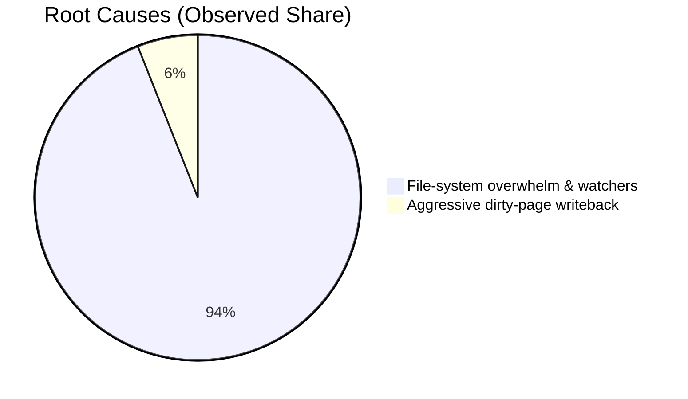
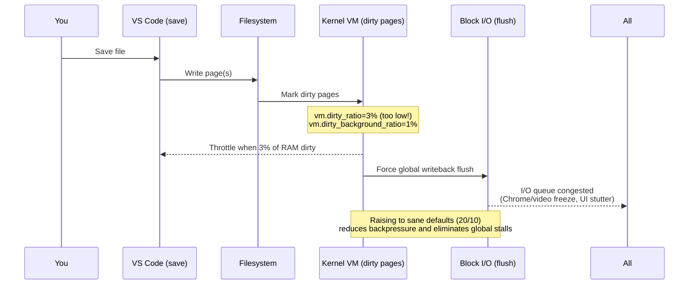
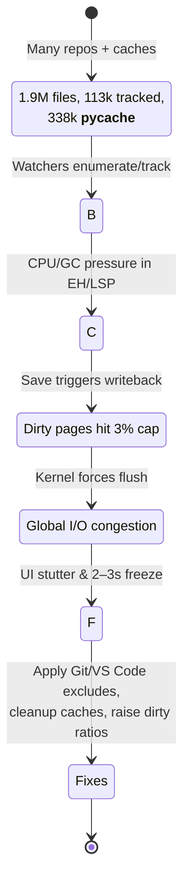
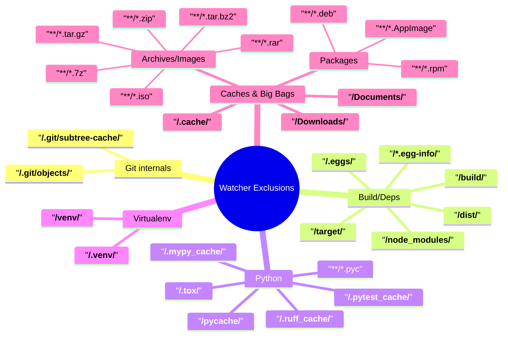
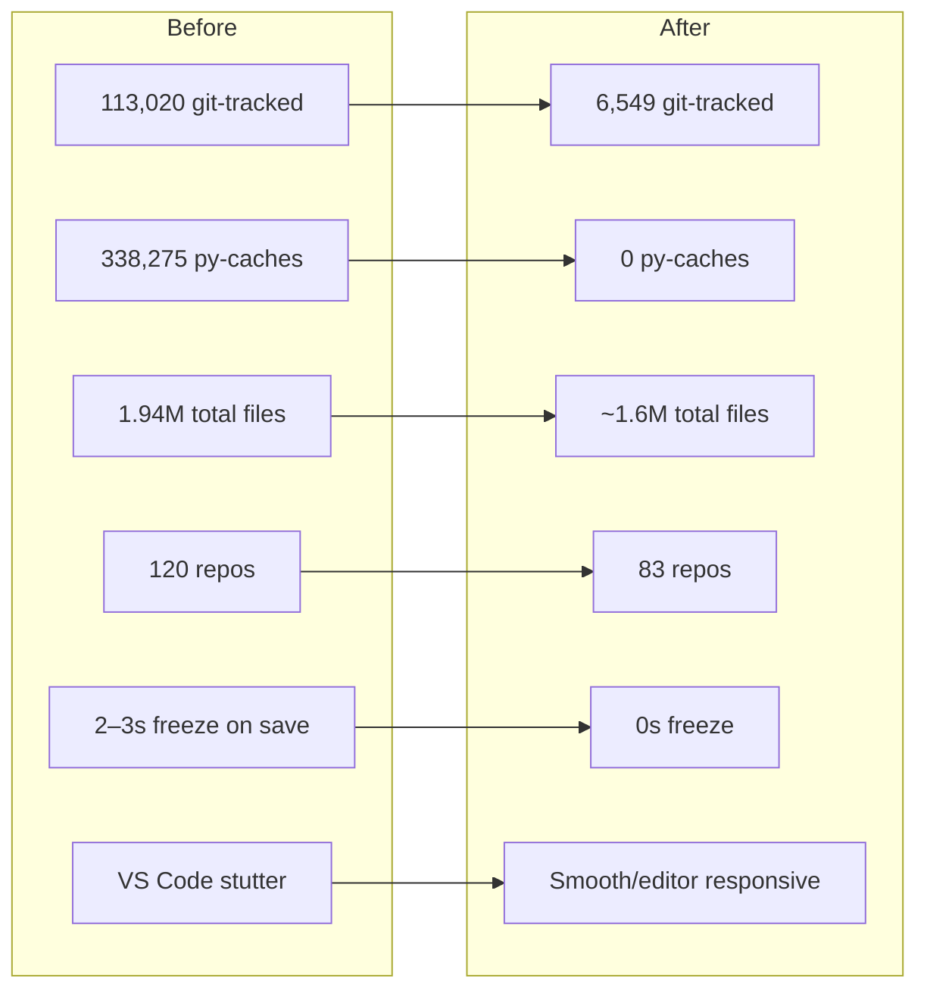
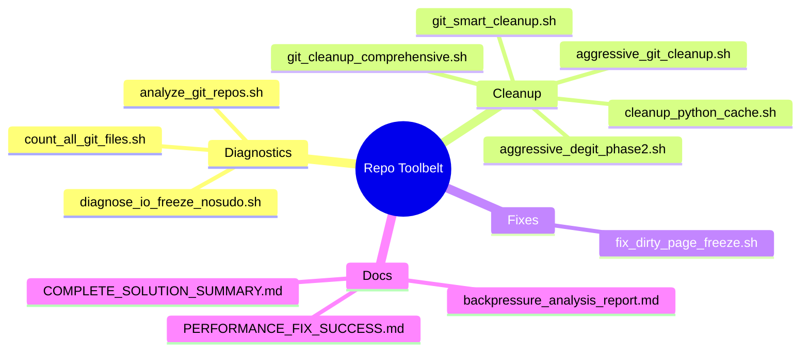
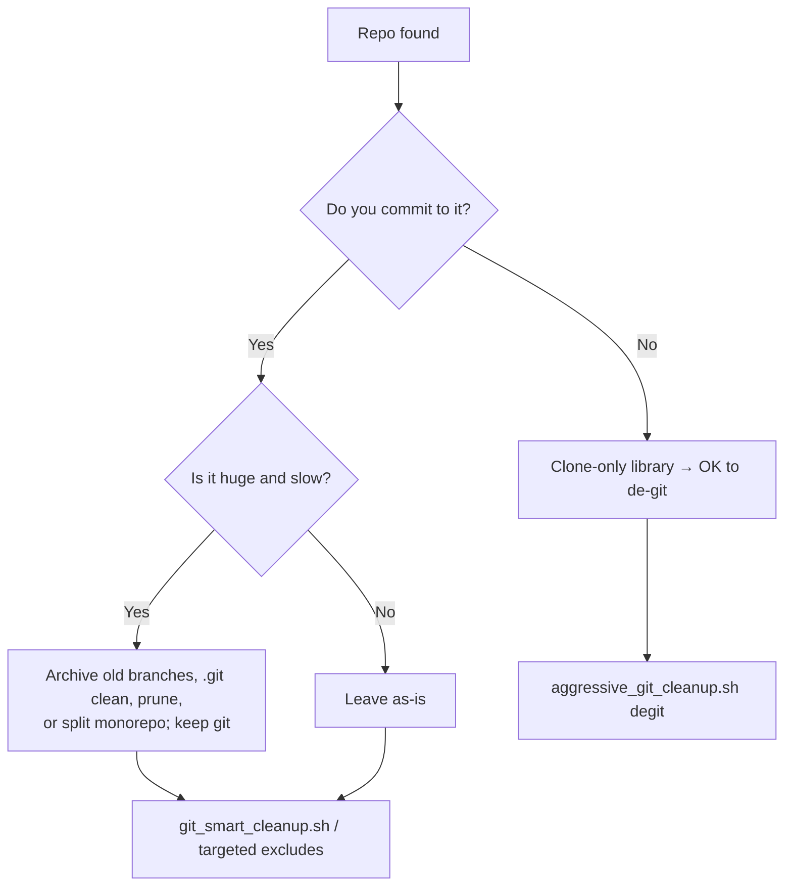
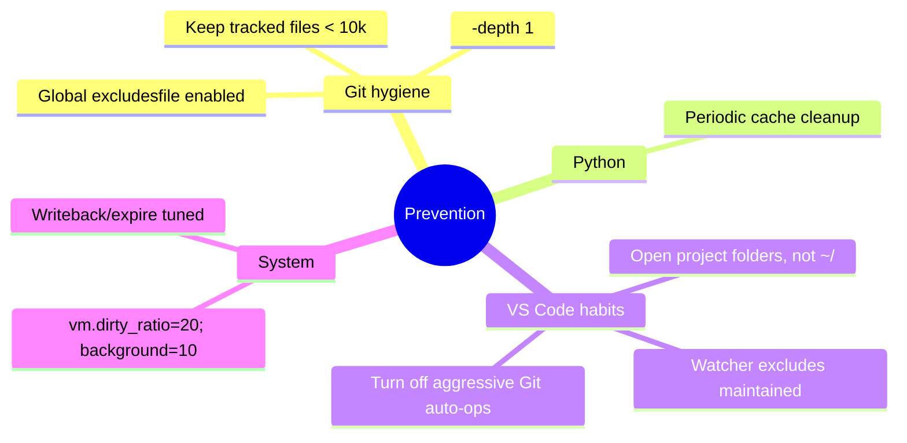

Here's the complete set with export-ready Mermaid code:

---

## 1) Problem Split Diagram
**Filename:** `problem-split.svg`


---

## 2) Dirty Writeback Freeze Sequence
**Filename:** `writeback-freeze-sequence.svg`


---

## 3) Quick Start Pipeline
**Filename:** `quick-start-pipeline.svg`
```mermaid
flowchart TD
  A[Start: Experiencing<br/>stutter/freezes] --> B{Run diagnostics}
  B -->|Git file count| C[count_all_git_files.sh]
  B -->|I/O freeze probe| D[diagnose_io_freeze_nosudo.sh]
  B -->|Python cache| E[cleanup_python_cache.sh]

  C --> F{> 10,000 tracked?}
  F -->|Yes| G[git_smart_cleanup.sh<br/>& aggressive_git_cleanup.sh]
  F -->|No| H[Proceed]

  D --> I{vm.dirty_* too low?}
  I -->|Yes| J[fix_dirty_page_freeze.sh<br/>(20/10/500/3000)]
  I -->|No| H

  E --> H

  H --> K[VS Code settings.json<br/>files.watcherExclude + git.*]
  K --> L{Still issues?}
  L -->|Yes| M[De-git clone-only libs<br/>aggressive_degit_phase2.sh]
  L -->|No| N[Verify]

  M --> N[Verify with Editor + Chrome,<br/>type/save/scroll → smooth]
```

---

## 4) VS Code + OS Architecture
**Filename:** `vscode-architecture.svg`
```mermaid
graph TD
  subgraph App
    R[Renderer (UI)] --- EH[Extension Host (Node)]
    R --- LSP[Language Servers]
    R --- FW[File Watchers]
    EH --- AI[Heavy/AI extensions]
    EH --- Lint[Linters/Formatters]
    EH --- GitUI[VS Code Git UI]
  end

  subgraph System
    FS[(Filesystem)]
    VM[(Kernel VM: dirty pages)]
    IO[(Block I/O / NVMe / SSD)]
  end

  FW <--> FS
  LSP <--> FS
  FS --> VM
  VM --> IO
  IO --> FS

  AI --> Net[(Network/API)]
  Lint --> CPU[(CPU)]
  R --> GPU[(GPU/Compositor)]

  classDef hot fill:#ffe6e6,stroke:#b33,stroke-width:1px;
  class FW,VM,IO,GitUI hot
```

---

## 5) File Bloat Logic Chain
**Filename:** `file-bloat-logic-chain.svg`


---

## 6) VS Code Settings Coverage Map
**Filename:** `settings-coverage-map.svg`


---

## 7) Results Dashboard
**Filename:** `results-dashboard.svg`


---

## 8) Toolbelt Map
**Filename:** `toolbelt-map.svg`


---

## 9) Safe De-git Decision Tree
**Filename:** `degit-decision-tree.svg`


---

## 10) Prevention Checklist
**Filename:** `prevention-checklist.svg`


---

## How to Export These to Actual Images

You have several options to convert these to SVG/PNG files:

### Option 1: GitHub Repository (Easiest)
1. Create `docs/diagrams/` directory in your repo
2. Add each Mermaid block as `.mmd` files
3. GitHub will render them when viewed

### Option 2: Mermaid CLI
```bash
# Install Mermaid CLI
npm install -g @mermaid-js/mermaid-cli

# Convert each diagram
mmdc -i problem-split.mmd -o docs/images/problem-split.svg -t dark
```

### Option 3: Online Mermaid Editor
1. Go to https://mermaid.live/
2. Paste each Mermaid code
3. Export as SVG/PNG
4. Save to `docs/images/`

### Option 4: VS Code Extension
1. Install "Mermaid Preview" extension
2. Create `.mmd` files
3. Use export functionality

---

## Recommended File Structure
```
docs/
├── diagrams.md          # Complete diagram pack (text)
├── images/              # Exported images
│   ├── problem-split.svg
│   ├── writeback-freeze-sequence.svg
│   ├── quick-start-pipeline.svg
│   └── ...
└── mermaid-source/      # Source .mmd files
    ├── 01-problem-split.mmd
    ├── 02-writeback-sequence.mmd
    └── ...
```
